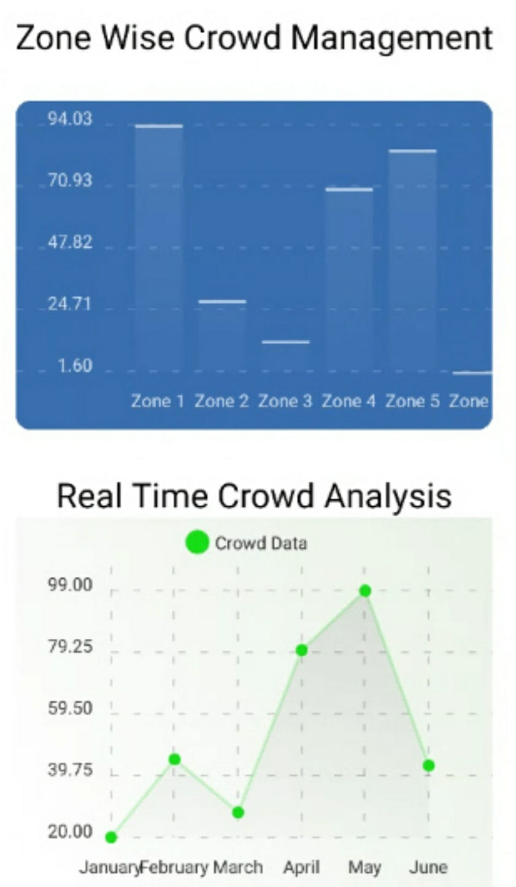
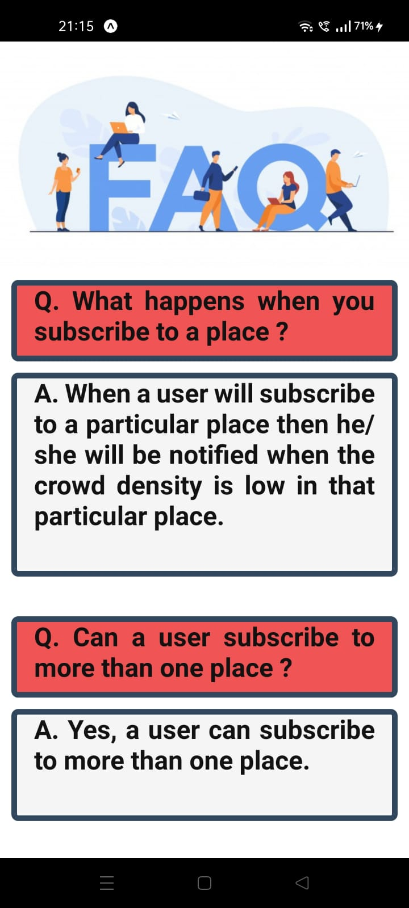

 [](https://forthebadge.com) [](https://forthebadge.com) [](https://forthebadge.com) [](https://forthebadge.com)
 [![forthebadge](data:image/svg+xml;base64,PHN2ZyB4bWxucz0iaHR0cDovL3d3dy53My5vcmcvMjAwMC9zdmciIHdpZHRoPSIxNTkuMzQiIGhlaWdodD0iMzUiIHZpZXdCb3g9IjAgMCAxNTkuMzQgMzUiPjxyZWN0IGNsYXNzPSJzdmdfX3JlY3QiIHg9IjAiIHk9IjAiIHdpZHRoPSI2NS4zMyIgaGVpZ2h0PSIzNSIgZmlsbD0iIzMxQzRGMyIvPjxyZWN0IGNsYXNzPSJzdmdfX3JlY3QiIHg9IjYzLjMzIiB5PSIwIiB3aWR0aD0iOTYuMDEiIGhlaWdodD0iMzUiIGZpbGw9IiMzODlBRDUiLz48cGF0aCBjbGFzcz0ic3ZnX190ZXh0IiBkPSJNMTUuNzAgMjJMMTQuMjIgMjJMMTQuMjIgMTMuNDdMMTUuNzAgMTMuNDdMMTkuNTEgMTkuNTRMMTkuNTEgMTMuNDdMMjAuOTggMTMuNDdMMjAuOTggMjJMMTkuNTAgMjJMMTUuNzAgMTUuOTVMMTUuNzAgMjJaTTMxLjA4IDIyTDI1LjczIDIyTDI1LjczIDEzLjQ3TDI3LjIxIDEzLjQ3TDI3LjIxIDIwLjgyTDMxLjA4IDIwLjgyTDMxLjA4IDIyWk0zNi44OSAxNC42NkwzNC4yNSAxNC42NkwzNC4yNSAxMy40N0w0MS4wMiAxMy40N0w0MS4wMiAxNC42NkwzOC4zNiAxNC42NkwzOC4zNiAyMkwzNi44OSAyMkwzNi44OSAxNC42NlpNNDYuMjYgMjJMNDQuNzcgMjJMNDQuNzcgMTMuNDdMNDYuMjYgMTMuNDdMNDYuMjYgMTcuNDdMNDcuMDggMTYuNDZMNDkuNTcgMTMuNDdMNTEuMzcgMTMuNDdMNDguMjAgMTcuMjVMNTEuNTUgMjJMNDkuNzkgMjJMNDcuMjIgMTguMzFMNDYuMjYgMTkuMzRMNDYuMjYgMjJaIiBmaWxsPSIjRkZGRkZGIi8+PHBhdGggY2xhc3M9InN2Z19fdGV4dCIgZD0iTTc5LjkwIDIyTDc3LjUyIDIyTDc3LjUyIDEzLjYwTDgxLjM2IDEzLjYwUTgyLjUwIDEzLjYwIDgzLjM0IDEzLjk4UTg0LjE4IDE0LjM1IDg0LjY0IDE1LjA2UTg1LjA5IDE1Ljc2IDg1LjA5IDE2LjcxTDg1LjA5IDE2LjcxUTg1LjA5IDE3LjY2IDg0LjY0IDE4LjM1UTg0LjE4IDE5LjA1IDgzLjM0IDE5LjQyUTgyLjUwIDE5LjgwIDgxLjM2IDE5LjgwTDgxLjM2IDE5LjgwTDc5LjkwIDE5LjgwTDc5LjkwIDIyWk03OS45MCAxNS40N0w3OS45MCAxNy45M0w4MS4yMiAxNy45M1E4MS45NSAxNy45MyA4Mi4zMiAxNy42MVE4Mi42OSAxNy4yOSA4Mi42OSAxNi43MUw4Mi42OSAxNi43MVE4Mi42OSAxNi4xMiA4Mi4zMiAxNS44MFE4MS45NSAxNS40NyA4MS4yMiAxNS40N0w4MS4yMiAxNS40N0w3OS45MCAxNS40N1pNOTEuOTcgMTguOTVMODguNzcgMTMuNjBMOTEuMjggMTMuNjBMOTMuMjcgMTYuOTRMOTUuMjYgMTMuNjBMOTcuNTYgMTMuNjBMOTQuMzUgMTguOTlMOTQuMzUgMjJMOTEuOTcgMjJMOTEuOTcgMTguOTVaTTEwMy40NCAxNS40OEwxMDAuODYgMTUuNDhMMTAwLjg2IDEzLjYwTDEwOC4zOCAxMy42MEwxMDguMzggMTUuNDhMMTA1LjgxIDE1LjQ4TDEwNS44MSAyMkwxMDMuNDQgMjJMMTAzLjQ0IDE1LjQ4Wk0xMTUuMTMgMjJMMTEyLjc1IDIyTDExMi43NSAxMy42MEwxMTUuMTMgMTMuNjBMMTE1LjEzIDE2Ljc2TDExOC4zNyAxNi43NkwxMTguMzcgMTMuNjBMMTIwLjc0IDEzLjYwTDEyMC43NCAyMkwxMTguMzcgMjJMMTE4LjM3IDE4LjcyTDExNS4xMyAxOC43MkwxMTUuMTMgMjJaTTEyNS40OCAxNy44MEwxMjUuNDggMTcuODBRMTI1LjQ4IDE2LjU1IDEyNi4wOCAxNS41NVExMjYuNjggMTQuNTYgMTI3Ljc1IDE0LjAwUTEyOC44MSAxMy40MyAxMzAuMTQgMTMuNDNMMTMwLjE0IDEzLjQzUTEzMS40NyAxMy40MyAxMzIuNTMgMTQuMDBRMTMzLjYwIDE0LjU2IDEzNC4yMCAxNS41NVExMzQuODEgMTYuNTUgMTM0LjgxIDE3LjgwTDEzNC44MSAxNy44MFExMzQuODEgMTkuMDUgMTM0LjIwIDIwLjA0UTEzMy42MCAyMS4wNCAxMzIuNTQgMjEuNjBRMTMxLjQ4IDIyLjE3IDEzMC4xNCAyMi4xN0wxMzAuMTQgMjIuMTdRMTI4LjgxIDIyLjE3IDEyNy43NSAyMS42MFExMjYuNjggMjEuMDQgMTI2LjA4IDIwLjA0UTEyNS40OCAxOS4wNSAxMjUuNDggMTcuODBaTTEyNy44NyAxNy44MEwxMjcuODcgMTcuODBRMTI3Ljg3IDE4LjUxIDEyOC4xOCAxOS4wNVExMjguNDggMTkuNjAgMTI4Ljk5IDE5LjkwUTEyOS41MSAyMC4yMCAxMzAuMTQgMjAuMjBMMTMwLjE0IDIwLjIwUTEzMC43OCAyMC4yMCAxMzEuMzAgMTkuOTBRMTMxLjgxIDE5LjYwIDEzMi4xMSAxOS4wNVExMzIuNDEgMTguNTEgMTMyLjQxIDE3LjgwTDEzMi40MSAxNy44MFExMzIuNDEgMTcuMDkgMTMyLjExIDE2LjU0UTEzMS44MSAxNiAxMzEuMzAgMTUuNzBRMTMwLjc4IDE1LjQwIDEzMC4xNCAxNS40MEwxMzAuMTQgMTUuNDBRMTI5LjUwIDE1LjQwIDEyOC45OSAxNS43MFExMjguNDggMTYgMTI4LjE4IDE2LjU0UTEyNy44NyAxNy4wOSAxMjcuODcgMTcuODBaTTE0MS44NyAyMkwxMzkuNTQgMjJMMTM5LjU0IDEzLjYwTDE0MS41MCAxMy42MEwxNDUuMjEgMTguMDdMMTQ1LjIxIDEzLjYwTDE0Ny41MyAxMy42MEwxNDcuNTMgMjJMMTQ1LjU4IDIyTDE0MS44NyAxNy41MkwxNDEuODcgMjJaIiBmaWxsPSIjRkZGRkZGIiB4PSI3Ni4zMyIvPjwvc3ZnPg==)](https://forthebadge.com)
<br/>

<p align="center">
  <a href="https://github.com/Vedanshi-Shah/CoVigilance">
    </a>
  
  <p align="center">
    A<strong> solution </strong>to ensure <strong>Crowd Management</strong> with<strong> Contactless</strong> and <strong>Safe Systems</strong>.
    <br />
    <a href="https://youtu.be/_c6WhlrnhAM">View Demo</a>
   
  </p>
</p>
<hr />


## Table of Contents

* [About the Project](#about-the-project)
  * [Real Time Analysis](#real-time-analysis)
  * [Notifications](#notifications)
  * [Built With](#built-with)
* [Getting Started](#getting-started)
  * [Installation](#installation)
* [Product Screenshots](#Product-Screenshots)
* [Team Members](#team)
* [Contact](#contact)

## About the Project
This project aims to solve the problems of – 

a.)	Administration people at various public places, event organizers, and security people – 
Managing the crowd and maintaining a safe social distance between them is a major challenge they face. To solve this problem, our team has designed a website that will continuously display the graph of social distancing and mask violations at that particular place. With the help of this, we can minimize the involvement of security personnel and efficient crowd management can be achieved easily. Also, the admin will get a clear idea of which zone is prone to a maximum number of violations and take the necessary actions.

b.)	General Public visiting that particular public place –
General Public does not have access to crowd data of a particular public place. To solve this problem, our team has designed a mobile app for the users. Our mobile app shows the list of public places, from which the user can subscribe to the public places he/she wants to visit. After subscribing to a particular public place, the user can see the real-time crowd density graph of that particular public place. Also, the user will be notified when the crowd density in that particular place is low. 

Thus, our website aims to solve problems faced by the administration and the mobile app solves problems faced by the general public.
To overcome 
### Real Time Analysis
We provide a real time analysis of the number of violations taking place in a zone. 
This analysis is available on the mobile app where the user gets to see the density graph and whether a place is safe to visit or not.
More detailed analysis is available for the admin side wherein he gets to see the count of mask and social distance violations.
### Notifications 
On our mobile app we prove notifications for the people about the place they have subscribed to. We generate these notifications when a crowded place turn safe to visit or a an uncrowded place becomes crowded.

### Built With 
<p float = "left">

 


 


 

</p>

## Getting Started

### Requirements
* Python >= 3.8.0
* TensorFlow
* SciPy

### Installation
* Clone the repository : 
```sh 
git clone https://github.com/Vedanshi-Shah/CoVigilance.git 
```

* Download the test Crowd Videos and then move it in the models folder.
  1. https://drive.google.com/file/d/123DBszblzSVITU1q2fkcxLG1TUTnSwqF/view?usp=sharing
  2. https://drive.google.com/file/d/12-Chv7a4NsYW6OeJgjHcB-Zf1qxcBJsC/view?usp=sharing
  3. https://drive.google.com/file/d/11zH2IXtrqBTcSzVz7xmrK8JR8clIjYFF/view
  4. https://drive.google.com/file/d/1R2Q9TzEi3FrG_9KFeOy_dm-Di-FwB9o1/view?usp=sharing

* Download the yolov3.weights from the link given below and move it in models folder.
  1. https://drive.google.com/file/d/1y8RPfw3fANEZsHtjsI7J-WG-cUm2adeb/view?usp=sharing

#### Mobile App 
1. Set up your expo environment in the Mobile_App folder.
   ```sh 
   npm i
   npm start   
   ```
2. Set up your React environment in the web-app folder.
   ```sh 
   npm i
   npm start   
   ```
3. From models folder run the placeA_zone1.py, placeA_zone2.py, placeA_zone3.py and placeA_zone4.py on different servers simultaneously.
 
## Product Screenshots

## ML Model
Mask Detection<br/><br/>
 <br/><br/>
# Web-app
Analytics Page<br/><br/>
 <br/><br/>
# Mobile-app
Main Page<br/><br/>
</a><br/>
Zone-wise Page<br/><br/>
</a><br/>
FAQ Page<br/><br/>
</a><br/>


## Tech Stack
* Backend
  * Python <br/>
* Database
  * Firebase <br/>
* Frontend
  * React Native
  * React <br/>
* Libraries
  * Scipy
  * OpenCV
  * TensorFlow
  * Chart.js <br/>

## Project made by
1. [Om Khare](https://github.com/OmKhare)
2. [Harshmohan Kulkarni](https://github.com/harshmohan07)
3. [Vedanshi Shah](https://github.com/Vedanshi-Shah)
